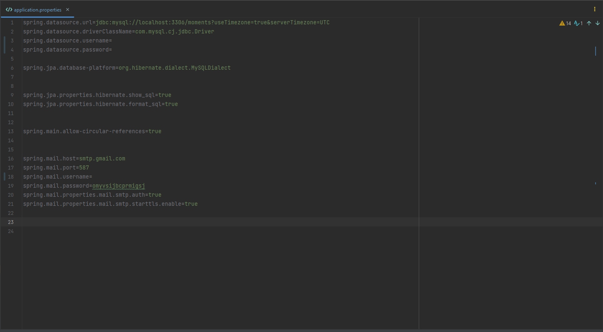

# Moments-BACK

**Projeto Criado para Discplina de Engenharia de Software, e com proposito de aprendizado.**

## **SOBRE O PROJETO**

O Moments-BACK é um projeto em Spring Boot que utiliza tecnologias como JPA, Hibernate e Maven. Ele fornece uma API RESTful que permite criar, atualizar, ler e excluir (CRUD) informações sobre momentos (como fotos, mensagens e vídeos) em um banco de dados. Além disso, o projeto inclui recursos como autenticação básica, internacionalização e validação de entrada.
***
## **ASSUNTOS TRABALHADOS E ESTUDADOS NO DECORRER DO PROJETO**

- Criação e Entendimento de um Projeto Spring Boot e sua Arquitetura
- Classes de Configuração e Servisos
- Annotations E Annotations Personalizadas
- Injeção de Depedencias.
- Configurar e se Conectar com Banco de Dados (Como o H2 em Memoria (Para testes) e MySql )
- Mapeamento de Entidades JPA (EntityMenager)
- JPA Repositories
- Query e @Query
- Implementar uma RESTFuL
- Mapear recursos REST
- Conhecimentos nas operações de POST, DELETE, GET, PUT, PATCH
- Conhecendo e utilizando códigos de Status apropiados
- LOMBOK project
- Bean Validation
- Internacionalização
- Autorização de url's de acordo com os perfis de usuario.
- Implementar Autenticação Basic
- Conficuração de WebSecurity
- Build e Deploy
- JAR e WAR
- Cross Origin
- Relacionamento de Entidades
- Testes Postman
- Microservice e-mail
***
## **FERRAMENTAS UTILIZADAS**

 As seguintes ferramentas foram utilizadas durante o desenvolvimento do projeto:
- 
- 

- 

- 
- 

- 

***

## **TECNOLIGIAS UTILIZADAS**

As seguintes tecnologias foram utilizadas durante o desenvolvimento do projeto:

- 

-  
- 

-  

**PRÉ-REQUISITOS PARA RODAR PROJETO**
- 
- 
- 
- 

***
## **COMO RODAR PROJETO**

<h7 align="center">1️⃣</h7> - Clone o projeto : https://github.com/viniciusDias1001/Moments.git

<h7 align="center">2️⃣</h7> - Abra o projeto e instale as dependencias maven:  `mvn install`

<h7 align="center">3️⃣ </h7> - Vá em application.properties e altere as informações para seu banco de dados:

- Crie o DataBase "moments"

- Altere:   `pring.datasource.username` e `spring.datasource.password`

<h7 align="center">4️⃣ </h7> - Ainda no  `application.properties` configure spring.mail , para mais detalhes sobre essa configuração : 

<h7 align="center">5️⃣</h7> - Crie as Tabelas no seu banco de dados. Script pronto no `meuEsquema.sql`

<h7 align="center">6️⃣ </h7> - Siga para classe `ProjectMomentsBackApplication.java` e de  
no metodo main:

---
# Get in touch

- 

- 

Esperamos que este projeto tenha sido útil para o seu aprendizado. Sinta-se à vontade para entrar em contato se tiver alguma dúvida ou sugestão de melhoria. Obrigado por ler!

